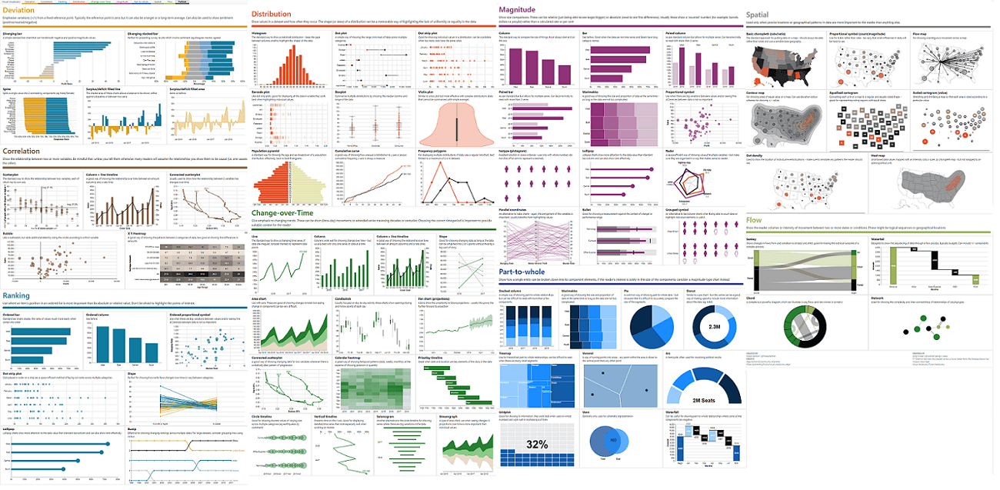
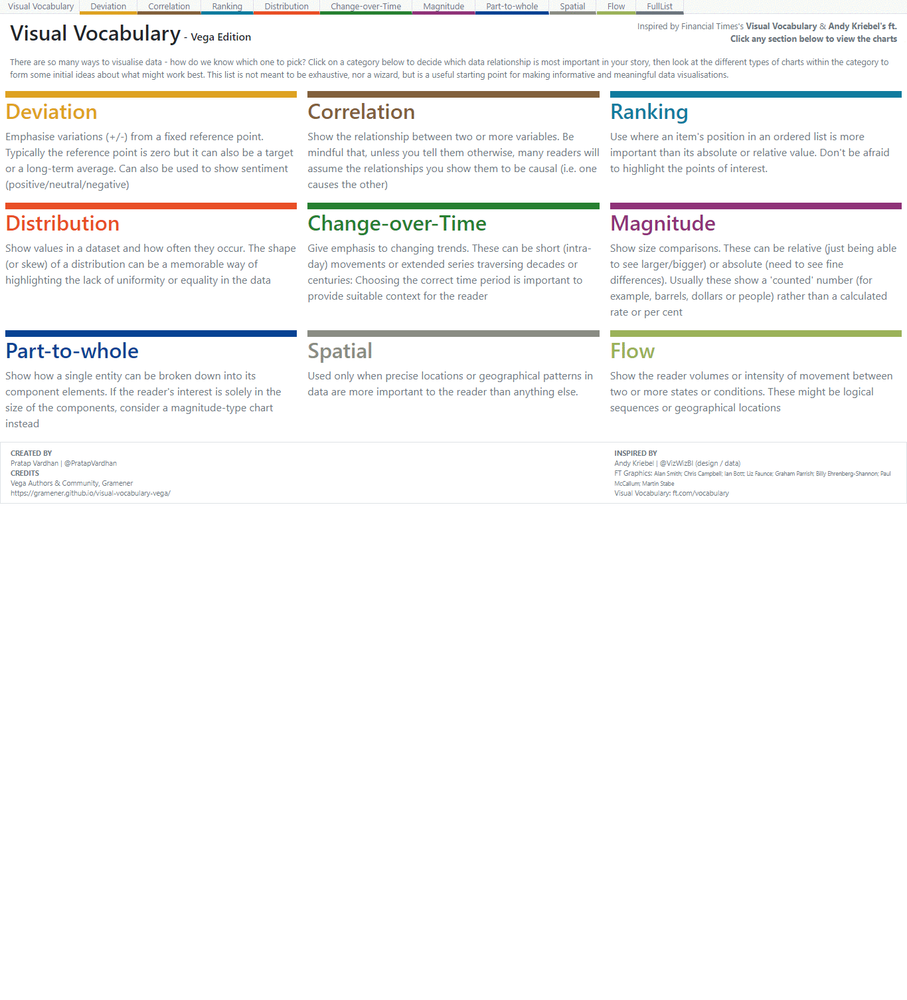

# Visual Vocabulary

Vega Edition by [Pratap Vardhan][pv], [Gramener][gramener]

Inspired by Financial Times's [Visual Vocabulary][ftv] & [Andy Kriebel's][ak] [edition][akb].

[][vvv]

Click on the gif below for the [interactive version][vvv].

[][vvv]

## Contributions and Support

Contributions are welcome.

[pv]: https://twitter.com/PratapVardhan
[ak]: https://twitter.com/VizWizBI
[akb]: http://www.vizwiz.com/2018/07/visual-vocabulary.html
[ftv]: https://ft.com/vocabulary
[vega]: https://vega.github.io/
[vvv]: https://gramener.github.io/visual-vocabulary-vega/
[gramener]: https://gramener.com/